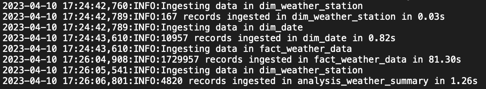

<!-- PROJECT LOGO -->
<br />
<div align="center">
  <a>
    
  </a>

  <h3 align="center">Weather Station API</h3>

  <p align="center">
    Building a Data Pipeline and Flask API using Python
  </p>
</div>

# Overview

<p align="center">
    
</p>

This project contains 4 main parts:
1. `data_model.py` - Designing a data model to represent the weather data records using SQLAlchemy ORM and SQLite3 database.
2. `data_ingestion.py` - Processing and ingesting the weather data stored in the `wx_data` folder into the database.
3. `data_analysis.py` - Performing calculations on ingested weather station data
4. `api.py` - Creating a Flask API and developing Swagger/OpenAPI documentation

Some other important parts of the project:
* I also defined some supporting functions and unit tests that are provided in the following modules:
`functions.py` `unit_tests.py`
* All the python modules are located inside the `src` folder.
* The SQLite3 database is stored in `database` folder. Due to the GitHub size limits, the `weather.db` file only contains an empty data model.
* Data ingestion logs are stored in `db.log` file in the root folder.
* Swagger/OpenAPI documentation is configured in `api_swagger.json`

## Getting Started

Clone this GitHub repository to your local machine or download it as a ZIP file. Then run the following steps to execute the data pipeline locally and interact with the API.

## Prerequisites and Installations 

Using the terminal, set the working directory to the root folder where the procject was cloned or unzipped. Open up terminal (command prompt on Windows) and use the `cd` command to navigate to the project folder.
```sh
  cd /your/local/folder
```

Based on your OS and python version installed, use one of the following to setup a virtual environment

* #### Create virtual environment 
Mac/Linux:
```sh
python3 -m venv venv
```
Windows:
```sh
python -m venv venv
```
NOTE: Using `python` or `python3` in Window's command prompt would depend on your python system installation.

* #### Activate virtual environment
Mac/Linux: 
```sh
source venv/bin/activate
```
Windows:
```sh
venv\Script\activate
```
NOTE: Alternatively, `venv\bin\activate` may be used depending on your python installation.

* #### Installing requirements in the virtual environment
Before installing pacakges from `requirements.txt`, install the following library:
```sh
pip3 install reverse_geocode==1.4.1
```

Now we are ready to install all the remaining python packages
```sh
pip3 install -r requirements.txt
```
Now we are ready to run our data pipeline.

## Running the code

### Data Pipeline

To run the data pipeline:
```sh
python3 src/run.py
```
NOTE: Runtime depends on your device specifications. For instance, my MacBook finished data ingestion in about 80-100 seconds but my PC took about 400 seconds. While the pipeline is being executed, we can track the progress using `db.log` file (sample screenshot below).

<p align="center">
    
</p>

`run.py` executes the following modules as well:
* `data_model.py`
* `data_ingestion.py`
* `data_analysis.py`
* `functions.py`

The data is stored in `database/weather.db`. More about data model can be found in *Database Design* section below.

### Flask API

To start the Flask API server:
```sh
python3 src/api.py
```

Once you see the server running in your terminal, go to the following endpoint `127.0.0.1:5000/swagger` to see the Swagger/OpenAPI style documentation. A sample screenshot is provided above.

We can use the `Try it out` feature of the Swagger documentation to test our API. We can filter our data by multiple optional parameters, as can be seen in this sample screenshot.


To get JSON responses from our API, use the following endpoints
* `127.0.0.1:5000/weather` - To retrieve daily weather records
* `127.0.0.1:5000/weather/stats` - To retrieve summarized weather records


`api.py` executes the following modules as well:
* `data_model.py`
* `unit_test.py`

It also uses the `api_swagger.json` to construct the Swagger/OpenAPI documentation.


Database, logs and api UI

### Components

Our data pipeline is executed using run.py

This executes the following modules:
data_model.py -> data_ingestion.py -> data_analysis.py

Describe the workflow and general architecture
Add workflow diagram

### Contact

<!-- ACKNOWLEDGMENTS -->
## Acknowledgments

Many thanks to Othneil Drew for creating this beautiful README template

* [README Template](https://github.com/othneildrew/Best-README-Template)

<p align="right">(<a href="#readme-top">back to top</a>)</p>