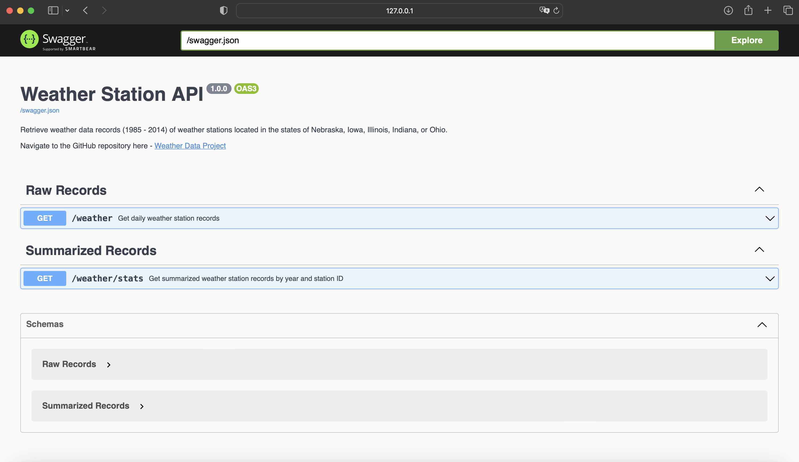

<!-- PROJECT LOGO -->
 

  

  <h3 align="center">Weather Data API</h3>

  

    Building a Data Pipeline and Flask API using Python
  

# Overview

    

This project contains 4 main parts:
1. Designing a data model to represent the weather data records using SQLAlchemy ORM and SQLite3 database.

2. Processing and ingesting the weather data stored in the wx_data folder into the database.
3. Creating a Flask API and developing Swagger/OpenAPI documentation

### Getting Started

Prerequisites 

In the terminal, 
cd to the working directory where the procject was cloned to or unzipped to.

Based on your OS and python version installed, use one of the following to setup a virtual environment

On Mac/Linux:
Create virtual environment: python3 -m venv venv
Activate virtual environment: source env/bin/activate

On Windows:
python -m venv venv
venv\Script\activate

Before running requirements.txt, run:
pip3 install reverse_geocode==1.4.1

Then:
pip3 install -r requirements.txt

### Running data pipeline

To run the data pipeline (runtime depends on your device, progress can be tracked using db.log file):
On Mac/Linux:
python3 src/run.py

On Windows (either one depending on your version of python):
python3 src/run.py
python src/run.py

### Running Flask API

To run the api:
On Mac/Linux:
python3 src/api.py

On Windows (either one depending on your python configuration):
python3 src/api.py
python src/api.py

Once you see the server running in terminal, go to the following endpoint to see the Swagger/OpenAPI style documentation
127.0.0.1:5000/swagger

To get JSON response use the following endpoints
127.0.0.1:5000/weather
127.0.0.1:5000/weather/stats

Database, logs and api UI

### Components

Our data pipeline is executed using run.py

This executes the following modules:
data_model.py -> data_ingestion.py -> data_analysis.py

Describe the workflow and general architecture
Add workflow diagram

### Contact

<!-- ACKNOWLEDGMENTS -->
## Acknowledgments

Many thanks to Othneil Drew for creating this beautiful README template

* [README Template](https://github.com/othneildrew/Best-README-Template)

(<a href="#readme-top">back to top</a>)
